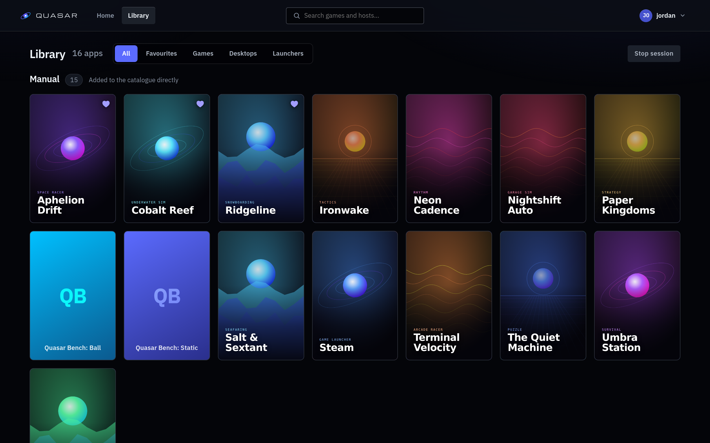
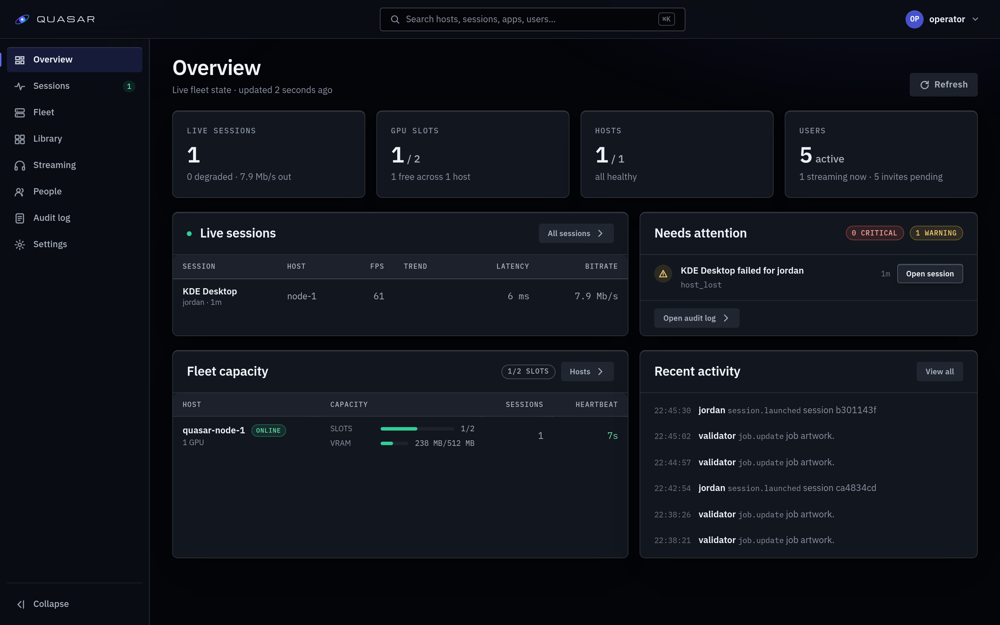

<p align="center">
  
</p>

<h1 align="center">Quasar</h1>

<p align="center">
  Self-hosted cloud gaming. Run games on your own GPU box, play them in a browser.
</p>

<p align="center">
  
</p>

Your hardware, your games, no subscription and no third party in the middle. Quasar
runs each app in a container on a GPU host you own and streams it over WebRTC to a
browser tab. Point a laptop, a tablet or an old desktop at it and play.

## What you get

- **Nothing to install on the client.** Any modern browser, any OS. No launcher, no
  agent, no client build to keep in step with the server.
- **Real multi-user.** Accounts, invite-only registration, admin and user roles, and
  per-user storage so saves and config follow the person, not the machine.
- **A web console.** Manage the app catalog, hosts and GPUs, live sessions, users and
  invites from the browser. No config files to hand-edit to add a game.
- **Library management.** Install apps from a catalog of digest-pinned images, or point
  it at your own.
- **Adaptive bitrate.** Tracks congestion and moves bitrate, resolution and frame rate
  mid-session, so a busy network degrades gracefully instead of stuttering.
- **Latency you can measure.** Glass-to-glass timing, per-session traces and a
  smoothness verdict, because "feels laggy" is not a bug report.
- **Hardware encode on NVIDIA, AMD and Intel**, with H.264, HEVC and AV1 chosen per
  session from what the GPU and the browser both support.
- **Microphone passthrough** into the app, for games and voice chat that expect one.

## What you need

- A **Linux host with a GPU** (NVIDIA, AMD or Intel). Not macOS or Windows: the node
  agent needs `network_mode: host`, which only Linux provides.
- **Docker Engine and Compose v2.20+.**
- The browser and the GPU host **on the same network** — a LAN, or a VPN that behaves
  like one. Media is a direct UDP connection between the two; the control plane being
  reachable does not make the GPU host reachable.

The host firewall has to accept inbound UDP on its ephemeral port range and UDP/5353
for mDNS. The agent detects a block at startup and logs the exact rule to add.
[Network requirements](https://accreleus.github.io/quasar/network/remote-access/) covers the detail,
including reverse proxies and playing from outside the house.

## Quick start

```bash
git clone --depth 1 https://github.com/accreleus/quasar.git
cd quasar

# 1. Configure. Generates the secrets; pin the release images per deploy/README.md.
cp deploy/.env.example deploy/.env && $EDITOR deploy/.env

# 2. Name this host in the TLS certificate, and create the home directory root.
bash deploy/seed-tls-hosts.sh deploy/.env
sudo install -d -m 0755 /var/lib/quasar/homes

# 3. Start it. Add -f deploy/docker-compose.nvidia.yml on an NVIDIA host.
docker compose -f deploy/docker-compose.yml up -d
```

Open **`https://<host-ip>:8443`**, accept the self-signed certificate warning, and claim
the admin account with the one-time token:

```bash
docker compose -f deploy/docker-compose.yml exec quasar-control-plane cat /run/quasar/setup-token
```

Full walkthrough, including pinning a release and the certificate options:
**[Install guide](https://accreleus.github.io/quasar/install/install/)**.

<p align="center">
  
</p>

## How it fits together

A **control plane** (Go) owns accounts, the API, signaling and scheduling, and holds no
per-host GPU state. A **node agent** (Rust) on each GPU host runs sessions: it drives the
GStreamer compositor and encoder and pushes the stream over a pluggable transport, with
WebRTC as the first one. That split is there from the first commit so the design has room
for more than one GPU host, though a supported install path for a second host is still
ahead of us.

Quasar stands on the shoulders of giants. The [Wolf](https://github.com/games-on-whales/wolf)
project (MIT) started container-based game streaming, and Quasar reuses its strongest
components: the `gst-wayland-display` Wayland compositor and `inputtino` virtual input.

## Documentation

**[accreleus.github.io/quasar](https://accreleus.github.io/quasar/)** is the place to
start: install, configure, operate, troubleshoot.

For working on Quasar itself: [`AGENTS.md`](AGENTS.md) is the operating contract,
[`docs/`](docs/README.md) holds the design record, [`docs/configuration.md`](docs/configuration.md)
documents every environment variable, and [`deploy/README.md`](deploy/README.md) is the
full deployment reference. The site source lives in [`site/`](site/README.md).

## Developing

The developer interface is the root Makefile — `make help` lists everything.

```bash
make init      # idempotent setup (submodule, devtools image, environment check)
make doctor    # is this machine ready?
make verify    # fmt + lint + build across all components
make test-db   # Go integration tests against a fresh ephemeral Postgres
make up        # local agentless stack for UI/API work
```

Each git worktree gets an isolated instance with its own ports, containers and test
database, so parallel checkouts never collide. GPU and streaming work needs a real GPU
host. [`docs/developer-tooling.md`](docs/developer-tooling.md) is the full catalogue.

Contributions welcome — see [`CONTRIBUTING.md`](CONTRIBUTING.md).

## License

MIT. See [`LICENSE`](LICENSE).
