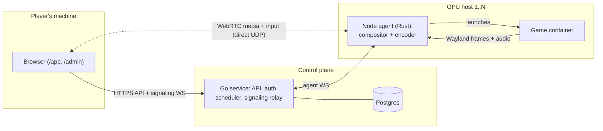

<p align="center">
  
</p>

# Quasar

Quasar is a self-hostable, multi-host cloud-gaming platform: run games on your own GPU servers and play them from a browser, aiming for a GeForce Now-like experience.

Quasar stands on the shoulders of giants. The [Wolf](https://github.com/games-on-whales/wolf) project (MIT) started the container based game streaming, and Quasar reuses its strongest components: the `gst-wayland-display` Wayland compositor and `inputtino` virtual input. Quasar takes a different direction from Wolf rather than replacing it: no Moonlight/GameStream protocol, WebRTC to the browser as the first transport, and multi-host / multi-user support built in from the start (with the architecture kept Kubernetes-ready for later).

In practice: a user registers, logs in, picks an app from the library, and plays it in the browser. The app runs in a container on a GPU host, streamed over WebRTC with hardware encode (AMD/Intel VA, NVIDIA NVENC, opt-in Vulkan), adaptive bitrate, virtual input, and per-user persistent storage. An admin area manages the app catalog, hosts, GPUs, sessions, and users.

> **Quasar** is a working placeholder name. Pick a final name and trademark/domain-check before any public launch.

## Quick start

You need a **Linux host with a GPU**, Docker Engine and Compose v2.20+, and a browser on the same network. (Not macOS or Windows: the node agent needs `network_mode: host`.)

```bash
git clone --depth 1 --branch v0.1.0 https://github.com/accreleus/quasar.git
cd quasar

# 1. Configure — generates the secrets and pins the release images.
#    Full block (copy-paste ready): deploy/README.md, Quick start step 2.
cp deploy/.env.example deploy/.env && $EDITOR deploy/.env

# 2. Name this host in the TLS certificate, and create the home directory root.
bash deploy/seed-tls-hosts.sh deploy/.env
sudo install -d -m 0755 /var/lib/quasar/homes

# 3. Start it. Add -f deploy/docker-compose.nvidia.yml on an NVIDIA host.
docker compose -f deploy/docker-compose.yml up -d
```

Then open **`https://<host-ip>:8443`**, accept the self-signed certificate warning, and claim the admin account with the one-time token:

```bash
docker compose -f deploy/docker-compose.yml exec quasar-control-plane cat /run/quasar/setup-token
```

**Full instructions, with the expected output after every command: [`deploy/README.md`](deploy/README.md).** That is also where the build-from-source path, GPU setup, HTTPS options and the firewall gotcha live. Releases are on the [releases page](https://github.com/accreleus/quasar/releases); upgrading is [`docs/upgrading.md`](docs/upgrading.md).

## Network requirements

Read this before deciding where to run Quasar. The UI, the API and WebRTC signaling are TCP and work through any reverse proxy. **The video, audio and input are different. They ride a direct connection between the browser and the GPU host, normally UDP.** The control plane being reachable does not make the GPU host reachable, and it is the GPU host that carries your stream.

**A LAN, or a VPN that acts like one, is the supported shape.** Put the browser and the GPU host on the same network segment and it works with no extra configuration. To play from somewhere else, join both ends to one private network first. Tailscale or an ordinary VPN both do this, and either is the recommended way to play from outside the house. The host needs to accept inbound UDP from your client devices on its ephemeral port range (`cat /proc/sys/net/ipv4/ip_local_port_range`, Linux default `32768-60999`) and on UDP/5353 for mDNS, because Chrome sends `.local` hostnames as its ICE candidates. The node agent runs with host networking, so those are ordinary host ports and a default-deny firewall will block them; the agent detects this at startup and logs the exact rule to add. Full writeup, including the per-firewall commands: [`deploy/README.md`](deploy/README.md#host-firewall-blocking-webrtc-media).

**Once you run more than one GPU host, a relay starts to earn its place.** Every host registers to the same control plane, and the scheduler places a session on whichever host has capacity. So a client can reach the control plane, see its library, launch fine, and still have no route to the machine that got the session, because that is a different machine on a different network. A relay is the standard answer to that case, and it is on the roadmap alongside multi-host setup. Until it lands, join both ends to one private network.

**Exposing the GPU host to the public internet works, and it is not what we recommend.** You would need the HTTPS port (8443 by default) reachable for the UI, the API and signaling, plus that whole inbound UDP range reachable from wherever you play. That is a wide open range on a machine whose job is to run games as containers with a GPU attached. Use a VPN instead. If you do it anyway, put a reverse proxy in front of it first — [`deploy/README.md`](deploy/README.md#advanced-fronting-quasar-with-your-own-reverse-proxy) covers pointing your own at the stack, and the bundled Caddy option for anyone without one. CGNAT on the player's side is one more case with no direct route.

**Docker Desktop on macOS or Windows cannot host Quasar at all.** The node agent needs `network_mode: host`, which only Linux provides. This is about the machine running the GPU host, not the machine you play from: any modern browser on any OS can be the client.

## Developing

The developer interface is the root Makefile — `make help` lists everything. Common flow:

```bash
make init      # idempotent setup (submodule, devtools image, environment check)
make doctor    # is this machine ready?
make verify    # fmt + lint + build across all components
make test-db   # Go integration tests against a fresh ephemeral Postgres
make up        # local agentless stack (postgres + control-plane + web) for UI/API work
make diagnose  # one-page state; make diagnose-bundle for a sanitized shareable bundle
```

Each git worktree gets an isolated instance (own ports, containers, test database), so
parallel checkouts never collide. `AGENTS.md` documents the full operating contract,
including which verification level each kind of change requires; the complete tooling
catalogue (targets, scripts, harnesses, skills) is
[`docs/developer-tooling.md`](docs/developer-tooling.md). GPU/streaming work runs on a GPU
host — see [`deploy/README.md`](deploy/README.md) and the repo skills.

## Architecture in one breath

A **control plane** (Go) handles accounts, API, signaling, and scheduling, and holds no per-host GPU state. A **node agent** (Rust) on each GPU host runs sessions: it drives the GStreamer compositor + encoder and pushes the stream over a pluggable transport (WebRTC first, native UDP later). Multi-host scheduling already works because of that split; Kubernetes support is planned and should be packaging rather than re-architecture, but no manifests exist yet (deployment today is Docker Compose).



Control traffic (login, launch, signaling) flows through the control plane; once a session is negotiated, video, audio, and input travel directly between the browser and the GPU host over WebRTC.

| Path | What |
|---|---|
| `control-plane/` | (Go) accounts, API, scheduler |
| `node-agent/` | (Rust) per-host agent: compositor, encode, sessions |
| `web/` | Unified web client (`/app` user area, `/admin` admin area) |
| `protocol/` | Frozen wire contracts (a `quasar-protocol` submodule) |
| `deploy/` | Compose stacks, images, dev tooling |
| `docs/` | All detailed documentation, starting at [`docs/README.md`](docs/README.md) |

## Documentation

Everything detailed lives under [`docs/`](docs/README.md):

- [`docs/README.md`](docs/README.md): documentation map, what works today, phase records, workstreams
- [`docs/architecture-and-plan.md`](docs/architecture-and-plan.md): the master rationale + roadmap
- [`deploy/README.md`](deploy/README.md): full deployment guide (GPU encode, services, dev workflow)
- [`docs/configuration.md`](docs/configuration.md): every env var, default, and accepted value
- [`docs/upgrading.md`](docs/upgrading.md): backing up before an upgrade, and recovering from a rolled-back control-plane binary

User-facing documentation (the public site) lives in [`site/`](site/README.md) and is
built with Astro Starlight. Run it locally with `npm install && npm run dev` in that
directory. It publishes to <https://accreleus.github.io/quasar/> via the `pages`
workflow, which is manual-dispatch only like the rest of this repo's CI.

**Status:** the foundational phases (0–5) and the optimization/adaptive-streaming workstreams are complete; current work follows the roadmap-spec-v2 wave ladder (see [`docs/README.md`](docs/README.md)).

## Working with AI agents

Read `CLAUDE.md` first (architecture invariants, frozen interfaces, conventions, model tiering), then `AGENTS.md` — the operational contract: canonical commands, verification levels per change type, instance isolation, and which operations require explicit authorization.

## License

MIT; see `LICENSE`. Update the copyright holder line to your name/org.
