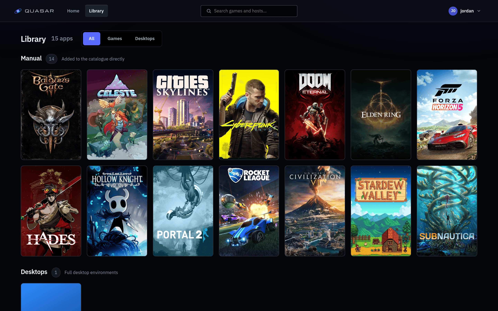
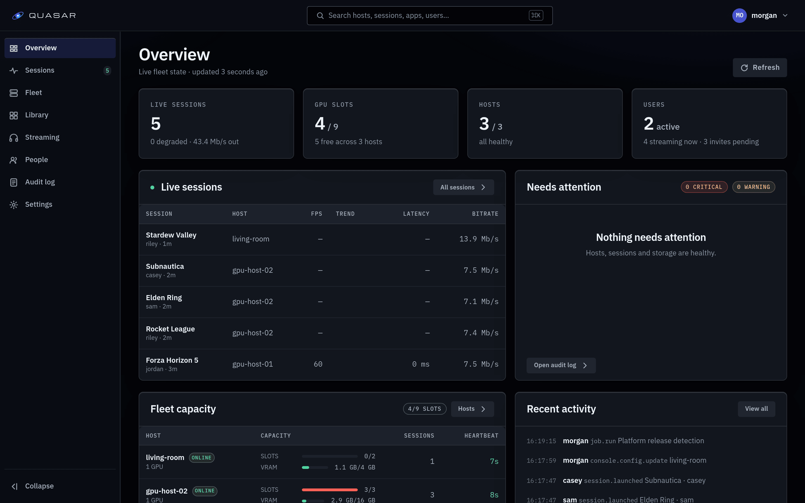

<p align="center">
  
</p>

<h1 align="center">Quasar</h1>

<p align="center">
  Self-hosted cloud gaming. Run games on your own GPU box, play them in a browser.
</p>

<p align="center">
  
</p>

Your hardware, your games, no subscription and no third party in the middle. Quasar
runs each app in a container on a GPU host you own and streams it over WebRTC to a
browser tab. Point a laptop, a tablet or an old desktop at it and play.

## What you get

- **Nothing to install on the client.** Any modern browser, any OS. No launcher, no
  agent, no client build to keep in step with the server.
- **Real multi-user.** Accounts, invite-only registration, admin and user roles, and
  per-user storage so saves and config follow the person, not the machine.
- **A web console.** Manage the app catalog, hosts and GPUs, live sessions, users and
  invites from the browser. No config files to hand-edit to add a game.
- **Library management.** Install apps from a catalog of digest-pinned images, or point
  it at your own.
- **Adaptive bitrate.** Tracks congestion and moves bitrate, resolution and frame rate
  mid-session, so a busy network degrades gracefully instead of stuttering.
- **Latency you can measure.** Glass-to-glass timing, per-session traces and a
  smoothness verdict, because "feels laggy" is not a bug report.
- **Hardware encode on NVIDIA and AMD** (Vulkan Video; Intel via VA-API, untested),
  with H.264, HEVC and AV1 chosen per session from what the GPU and the browser both
  support.
- **Microphone passthrough** into the app, for games and voice chat that expect one.

## What you need

| | |
| --- | --- |
| Host | Linux with a GPU (NVIDIA, AMD or Intel). Not Docker Desktop, macOS, Windows or WSL. |
| Engine | Docker (rootful: supported, also on Unraid). Podman and rootless modes: experimental. |
| NVIDIA | Driver 610+ and the NVIDIA Container Toolkit. |
| Network | The browser reaches each GPU host directly, over a LAN or a VPN. |
| Browser | Recent Chrome or Chromium. |

Full list, ports and firewall rules:
**[Requirements](https://accreleus.github.io/quasar/start/requirements/)**.

## Install

1. Open the **[quick start](https://accreleus.github.io/quasar/start/quickstart/)**,
   pick your engine, GPU and storage. It gives you one **seed** container: a
   `docker run` command, or a stack for Dockge, Arcane or Unraid.
2. Prepare the host as the quick start shows, then start the seed. It installs
   Postgres, the control plane and the node agent, generates the secrets, and keeps
   them running.
3. Open `https://<host>:8443`, accept the self-signed certificate, and claim the
   admin account with the one-time token from
   `docker exec quasar-control-plane cat /run/quasar/setup-token`.
   [First run](https://accreleus.github.io/quasar/install/first-run/)

**How to know it worked:** `curl http://localhost:8080/health` returns
`{"status":"ok","db":"ok"}`, and the host shows online in **Admin ▸ Fleet ▸ Hosts**.

| Then | Where |
| --- | --- |
| Add another GPU host | **Admin ▸ Fleet ▸ Add host** gives a one-line command. Read the script before you run it. [Guide](https://accreleus.github.io/quasar/install/second-host/) |
| Update | **Admin ▸ Fleet ▸ Releases**. New installs follow the `stable` channel; `edge` follows a branch. A failed update rolls back. [Releases](https://accreleus.github.io/quasar/admin/releases/) |
| Coming from 0.3.0 or a Compose install | Not updated in place: install fresh and restore your database dump. [Moving an install](https://accreleus.github.io/quasar/install/moving/) |

<p align="center">
  
</p>

## How it fits together

A **control plane** (Go) owns accounts, the API, signaling and scheduling, and holds no
per-host GPU state. A **node agent** (Rust) on each GPU host runs sessions: it drives the
GStreamer compositor and encoder and pushes the stream over a pluggable transport, with
WebRTC as the first one. One control plane serves any number of GPU hosts. On each
machine a small **recovery actor**, started by the seed, owns Quasar's containers and
applies updates through the container engine's API.

Quasar stands on the shoulders of giants. The [Wolf](https://github.com/games-on-whales/wolf)
project (MIT) started container-based game streaming, and Quasar reuses its strongest
components: the `gst-wayland-display` Wayland compositor and `inputtino` virtual input.

## Documentation

**[accreleus.github.io/quasar](https://accreleus.github.io/quasar/)** is the place to
start: install, configure, operate, troubleshoot. It documents the newest stable
release; [`/quasar/edge/`](https://accreleus.github.io/quasar/edge/) documents `develop`.

For working on Quasar itself: [`AGENTS.md`](AGENTS.md) is the operating contract,
[`docs/architecture-and-plan.md`](docs/architecture-and-plan.md) is the design record,
[`docs/configuration.md`](docs/configuration.md) documents every environment variable, and
[`deploy/README.md`](deploy/README.md) covers source-built stacks. The site source
lives in [`site/`](site/README.md).

## Developing

The developer interface is the root Makefile — `make help` lists everything.

```bash
make init      # idempotent setup (submodule, devtools image, environment check)
make doctor    # is this machine ready?
make verify    # fmt + lint + build across all components
make test-db   # Go integration tests against a fresh ephemeral Postgres
make up        # local agentless stack for UI/API work
```

Each git worktree gets an isolated instance with its own ports, containers and test
database, so parallel checkouts never collide. GPU and streaming work needs a real GPU
host. [`docs/developer-tooling.md`](docs/developer-tooling.md) is the full catalogue.

Contributions welcome — see [`CONTRIBUTING.md`](CONTRIBUTING.md).

## License

MIT. See [`LICENSE`](LICENSE).
